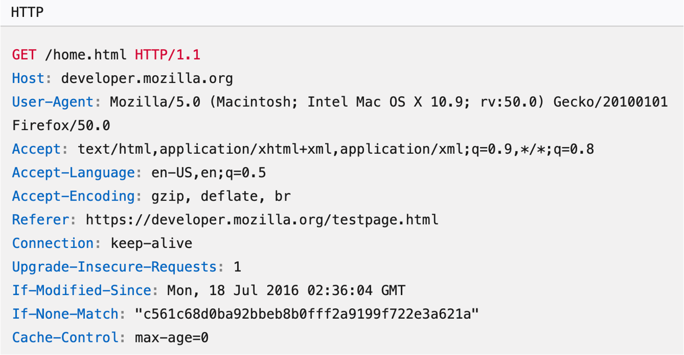
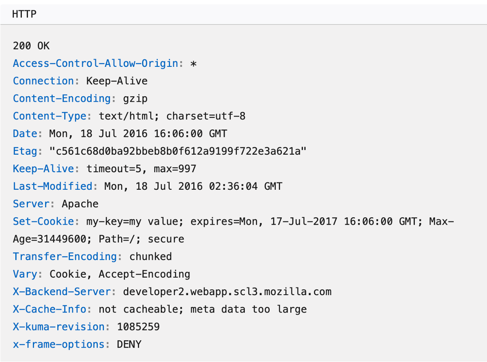

# Lecture 4 - Application Layer - Part 2

## Overview

We will wrap up the Application Layer (Layer 7) from the Kurose / Ross book diving a bit deeper into HTTP and then looking at FTP, SMTP, P2P, and streaming video. Some of the content (particularly Netflix / CDNs) will likely stretch to Monday.

## Readings

* Readings - Lecture 4 (This lecture and portions of the first lecture)
   * Browse Chapter 2 in the book. If you do not have the Kurose / Ross book yet, you can access the free Peterson / Davies book Links to an external site. and also read through Chapter 9 in that book.

## Handouts

* This Overview

## Key Points

* What is the general syntax for HTTP requests? What are various headers?
* What are cookies? What are the different types of cookies?
* What is web caching? What does it mean to proxy?
* Compare / contrast: FTP, SMTP, HTTP, BitTorrent
* Explain DASH
* Explain what a CDN is

## Examples

| Client GET | Server Response |
|---|---|
|  |  |

## Upcoming Due Dates

| **Date** | **Item** | **Topic** |
|---|---|---|
| 09-06 (Sun) | [Assignment]((https://canvas.nd.edu/courses/145183/assignments/498192)) | [Homework 2 - Wireshark + Prompts](../../homework/hw02/hw02.md) |
| 09-07 (M) | Reading | Chapter 3 - Transport Layer |
| 09-13 (Sun) | Assignment | Homework 3 - Analysis + Prompts |