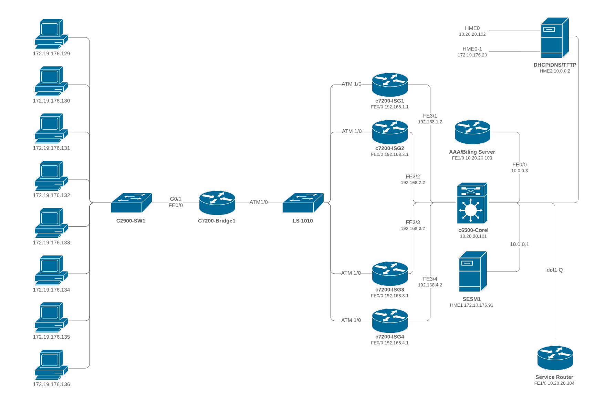

# Lecture 12 - Data Plane (continued)

## Overview

In the last lecture, we continued our discussions on the data plane and began review questions for the mid-term exam.  We continued with the data plane walking through subnets and discussed data forwarding, particularly the IPv4 and IPv6 headers.  In today's lecture, we do a few practice items on subnets and then discuss NAT, DHCP, and possibly Software Defind Networking (SDN).  If time allows, we will then begin our pivot to the control plane.

## Readings

* Chapter 4 - Kurose / Ross - Data Plane
* Chapter 5 - Kurose / Ross - Control Plane

## Examples

## Key Points

* Data Plane
   * What is a subnet?
   * What is NAT? Why does it make our life hard?
   * What is DHCP? What is the v6 equivalent?
   * What is SDN? What makes it “different”?

## Looking Ahead

| **Date** | **Item** | **Topic** |
|---|---|---|
| 09-28 (M) | Reading | Chapter 5 - Control Plane (for Wednesday) |
| 10-04 (Sun) | Assignment | [Coding Project 1 - Part 1](../../homework/cp1/cp1-pt1.md) |
| 10-12 (M) | Extra Credit | Study Sheet for Mid-Term Exam (due at 12 PM) |
| 10-12 (M) | Exam | Mid-Term Exam - in class |
